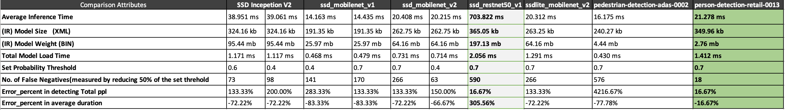
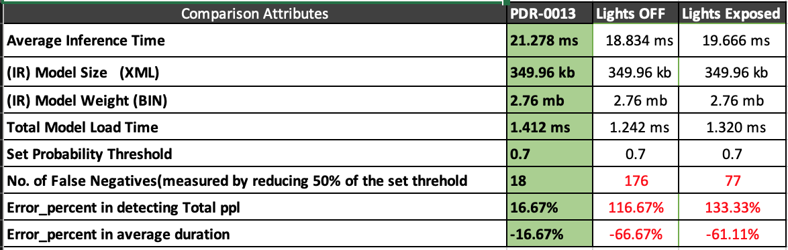
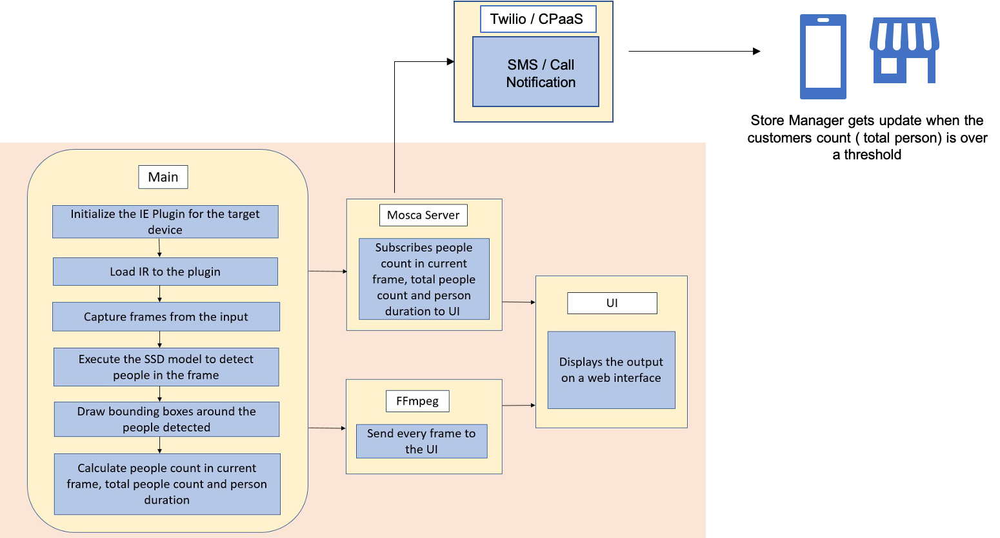

# Project 1 - People Counter App

## Summary 
In this project, test was carried out to find a person detection model and convert it to an Intermediate Representation for use with the Model Optimizer. Utilizing the Inference Engine, performed the inference on the input video (`resources/Pedestrian_Detect_2_1_1.mp4`) and identified a reasonable model for this use case.

To develop the present project, tests were carried out with the following models,

- ssd mobilenet v1 
- ssd mobilenet v2 
- ssd inception v2 
- ssd restnet_50 v1 
- ssdlite mobilenet v2 

And also tested against some of the Intel® pre-trained models , namely

- Pedestrian detection adas 002
- Person detection retail 0013

And the following write up explains the implementation approach , comparison of the model performance , a short study on the impact of external environment (like lighting) and the outcome.

## Basic Execution / Requirement.

This projects covered the following parts 

1. Perform inference on the identified model

2. Processing the video (from handling different input streams to calculating the required statistics)

3. Sending the calculated statistics and the output buffer to the server (with the helper boilerplates already provided to visualise these outputs)


## Toolkit versions used

- OpenVino 2020.2.117
- OpenCV 4.2.0.32
- TensorFlow 1.2.0.0

The basic execution of the app is as follows:

```
python main.py -i [CAM|Video|Image] -m [file of model in .xml format] -d [GPU|CPU|MYRIAD] -p [values from 0.0 to 1.0]  | ffmpeg -v warning -f rawvideo -pixel_format bgr24 -video_size 768x432 -framerate 24 -i - http://0.0.0.0:3004/fac.ffm
```

Execution example:
```
python main.py -i resources/Pedestrian_Detect_2_1_1.mp4 -m model/ssd_inception_v2/frozen_inference_graph.xml  -p 0.7 | ffmpeg -v warning -f rawvideo -pixel_format bgr24 -video_size 768x432 -framerate 24 -i - http://0.0.0.0:3004/fac.ffm
```

or incase of a pre-trained model

```
python main.py -i resources/Pedestrian_Detect_2_1_1.mp4 -m model/person-detection-retail-0013/intel/person-detection-retail-0013/FP32/person-detection-retail-0013.xml -p 0.7 | ffmpeg -v warning -f rawvideo -pixel_format bgr24 -video_size 768x432 -framerate 24 -i - http://0.0.0.0:3004/fac.ffm
```


## Perform inference on the identified model

As a part of the inital model research , the following link helped in knowing different available models 

[Tensorflow Object Detection Model Zoo](https://github.com/tensorflow/models/blob/master/research/object_detection/g3doc/detection_model_zoo.md)


### Following are the links for the models considered for this project purpose.

- [ssd mobilenet v1](https://download.tensorflow.org/models/object_detection/ssd_mobilenet_v1_coco_2018_01_28.tar.gz)
- [ssd mobilenet v2](https://download.tensorflow.org/models/object_detection/ssd_mobilenet_v2_coco_2018_03_29.tar.gz)
- [ssd inception v2](https://download.tensorflow.org/models/object_detection/ssd_inception_v2_coco_2018_01_28.tar.gz)
- [ssd restnet_50 v1](https://download.tensorflow.org/models/object_detection/faster_rcnn_resnet50_coco_2018_01_28.tar.gz)
- [ssdlite mobilenet v2](https://download.tensorflow.org/models/object_detection/ssdlite_mobilenet_v2_coco_2018_05_09.tar.gz)

Following the reference from [Converting TensorFlow* Object Detection API Models](https://docs.openvinotoolkit.org/latest/_docs_MO_DG_prepare_model_convert_model_tf_specific_Convert_Object_Detection_API_Models.html) , the following steps where followed to convert the above models to an  Intermediate Representation with the Model Optimizer


* Step 1: Download the model and Untar(e.g.,) 

```

wget http://download.tensorflow.org/models/object_detection/ssd_mobilenet_v1_coco_2018_01_28.tar.gz

tar -xvpf ssd_mobilenet_v1_coco_2018_01_28.tar.gz

cd ssd_mobilenet_v1_coco_2018_01_28/
```


* Step 2: Convert the model to IR with the model optimizer using the following command.

```
python /opt/intel/openvino/deployment_tools/model_optimizer/mo.py --input_model frozen_inference_graph.pb --tensorflow_object_detection_api_pipeline_config pipeline.config --reverse_input_channels --tensorflow_use_custom_operations_config /opt/intel/openvino/deployment_tools/model_optimizer/extensions/front/tf/ssd_v2_support.json
```

* Step 3: Get the model binary and model weights.

After the above step , the following files will be generated upon a sucessful execution.

```
  * frozen_inference_graph.bin
  * frozen_inference_graph.xml
```

These two files are the ones that will be used to run over inference on the input stream.


Incase of an pretrained model (Pedestrian detection adas 002 , Person detection retail 0013 in this context) , the above artefacts ( .bin & .xml) are pre-built and optimized, and hence are ready to use directly.

## Comparing Model Performance
With the above said approach , IR for various models where created and upon execution , the following was the result. 




### Quick observations on the above data,

* The average inference time across all the model ranges from 14 ms to 40 ms ( expect for `ssd_restnet50` which clocked over 700ms)

* Whilst the model size of pretrained model are optimized and less than 5 mb , other custom model size ranges from >25mb to over 100mb

* The error rate in deducing the people count were over 100% except for `SSD restnet50` and (pre-built) `person_detection_retail_0013`. However with Inference time of over 700ms SSD restnet50 might not be practically viable for this specific usecase.


P.S.: all the inference where executed at the probability threshold (confidence) of 0.7 and to draw some intution and calculate the false negatives , the color code for bounding boxes switches to yellow at 75% of the set confidence and red color at 50% of the set confidence.


## Assess Effects on End User Needs

Lighting, model accuracy, and camera focal length/image size have different effects on a
deployed edge model. 

And to have some intution on these external environment , following experiment was conducted

### Updating gamma to mimic video effect.

The file `adjustLighting.py` has a utility function to update the gamma with the following method , and the output file was genereted with underexposed and overexposed lighting to understand the effect on the model performance.

```
def adjust_gamma(frame, gamma=1.0):

   invGamma = 1.0 / gamma
   table = np.array([((i / 255.0) ** invGamma) * 255
      for i in np.arange(0, 256)]).astype("uint8")

   return cv2.LUT(frame, table)
```


For this experiment , the `person_detection_retail_0013` was chosen as the model since it had performed better when compated to all the other models (as explained in the previous section)

And when the inference was performed on underexposed and overexposed videos , the following was the output.



### Observation 

* Even the best performing model in an ideal environment , had a major effect with lighting.

Low Lighting

* From the bounding box , it is observed that confidence is lesser ,and the area of selection wasn't accurate either.
* It also had  major issue with both false positives & false negatives , detecting the table to be a person !!


Over exposed 

* In case of the Over exposure , whilst the false postives are less , the confidence is still very low.


 Lights OFF          |  Lights Over Exposed
:-------------------------:|:-------------------------:
 |  

Nevertheless , it's evident that more optimisation would be required for a model if there is any change in the external environment !

## Other potential Use Cases with this model

With the current model , the use case can be expanded to be used in a store by a store manager , with the slight enhancement as below ,



By this , the store manager gets a real time update on the visitor , there by taking any necessary action can opening more self service checkout / open new counters etc.,

Similarly , other cases like physical distance measures in airport or other public places could also be considered.

